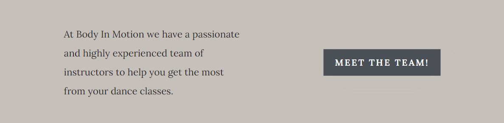

# BIM-Dance-Studio

Website for a dance studio based in Edinburgh

[View the live website here](https://lestece.github.io/BIM-Dance-Studio/)

## TABLE OF CONTENTS
1. [INTRODUCTION](#1-introduction)
2. [USER EXPERIENCE DESIGN](#2-user-experience-design)
    - [User persona & their goals/needs](#user-persona--their-goalsneeds)
    - [Business goals](#business-goals)
    - [Wireframes](#wireframes)
    - [Design](#design)
        - [Colors](#colors)
        - [Icons](#icons)
        - [Typography](#typography)
        - [Images](#images)
        - [Mockups](#mockups)
3. [FEATURES](#3-features) 
    - [Existing features](#existing-features)
        - [Header](#header)
        - [Hero Section](#hero-section)
        - [Classes Section](#classes-section)
        - [Instructors Section](#meet-the-team-section)
        - [Pricing Section](#pricing-section)
        - [Location Section](#location)
        - [Footer](#footer)
        - [Instructors page](#instructors-page)
        - [Classes & Prices page](#classes--prices-page)
            1. [Classes timetable section](#1--classes-timetable)
            2. [Prices section](#2--prices)
        - [Booking page](#booking-page)
        - [Booking confirmation page](#booking-confirmation-page)
        - [Back to top button](#back-to-top-button)
    - [Features to implement in the future](#features-to-implement-in-the-future)
4. [TESTING](#4-testing)
5. [CREDITS](#5-credits)
6. [DEPLOYMENT](#6-deployment)

## 1. INTRODUCTION

This site has been created as a business website for __a fictional Dance Studio, called BIM (Bodies in Motion) based in Edinburgh__. The studio offers adults dance classes, from beginner to advanced levels, in Ballet, Jazz, Contemporary and Afro dance.

I've created this static front-end website to _showcase my knowledge of HTML and CSS, accessibility, responsitivity and UX Design._
The design is clean, modern and elegant to reassure users about the dance studio professionality and reliability. 

## 2. USER EXPERIENCE DESIGN

### USER PERSONA & THEIR GOALS/NEEDS

Users are adults based in Edinburgh who want to:

- learn how to dance/improve their dancing skills
- be taught by qualified and trustworthy professionals
- be able to see a class timetable to decide if it would work around their schedule
- have clear pricing information
- have the chance to contact and locate easily the dance studio
- easily book a class with just a couple of clicks using their devices

### BUSINESS GOALS

- increase the amount of class participants and consequently the business revenue
- promote the dance studio online presence

### WIREFRAMES

All wireframes were created with [Figma](https://www.figma.com/) while keeping in mind the user needs and business goals, so that the result focuses on prioritizing the right content in a clear and concise way. 

[See wireframes here](docs/wireframes)

### DESIGN

- #### COLORS

I've used [Coolors](https://coolors.co/) website to generate a colour palette for the website. 

The palette was generated from the homepage __hero image__ and then adjusted to my personal preferences. The result is a palette that fits well with the whole design and images chosen.

I wanted to keep a good contrast between text and background, so that most of the website has been styled using a white background and the dark grey color __(#2a282c)__ for paragraphs.

__#2C343C__ (dark-blue color) has been mostly used for the nav bar, hero section (homepage, with a white text color for contrast), footer background and some buttons background colors. 

__#c5c0b9__ (creamy color) has been mainly used as a background color for some sections, buttons and headings.

- #### ICONS
Icons were needed for the social media links and have been taken from [FontAwesome](https://fontawesome.com/).

- #### TYPOGRAPHY
The chosen fonts fo the website are:
1. __Lora__, which is 
> a well-balanced contemporary serif with roots in calligraphy.

It's a modern and artistic font, mostly used for headings and buttons. It reverts to serif if not available.

2. __Nunito__ , a simple and easily readable sans serif, mainly used for the paragraphs, that pairs well with Lora.
Sans-serif is the font fallback.

- #### IMAGES

All images have been selected and taken from [Pexels](https://www.pexels.com) and then compressed and optimized using [TinyPNG](https://tinypng.com/).

- #### MOCKUPS
After all of the design details were decided and the website content composed, I've used [Figma](https://www.figma.com/) to create mockups for all of the website pages and different screen sizes so that I'd have a high-fidelity website simulation to follow as a coding guide: the result is an aesthetically pleasing design that helps satisfying the website goals.

[See mockups here](docs/mockups)

## 3. FEATURES

### EXISTING FEATURES

- #### HEADER

The header appears at the top of all of the website pages and stays consistent and responsive across all of them.
It features an absolute positioning so that it stands on top of the hero sections and has a transparent background for the hero images to come trough.
It is a flex container and flexbox properties have been used to achieve the different displays based on screen size.

On large screen sizes the logo is positioned on the left of the header, while the navigation bar is on the right.

On tablets views the header is displayed in two different rows, with the logo at the top and the nav bar below it (flex direction changed to column).

 

In smaller screen sizes the header goes back to display the logo on the left, with the difference that now the navigation bar has been replaced by an hamburger menu. The header is also now positioned fixed so that if the user doesn't close the hamburger menu and keeps scrolling the page, there's no breakage since the hamburger menu opens in a fixed window.

The hamburger menu has been inspired by [this tutorial](https://dev.to/devggaurav/let-s-build-a-responsive-navbar-and-hamburger-menu-using-html-css-and-javascript-4gci) on the __Dev Community__.

- #### HERO SECTION

The hero section showcases the dance studio flair: with a catchy background image overlayed by a captivating intro about the website objective, it also contains an immediate call to action for users to book a class.

- #### CLASSES SECTION

After a brief introduction, the classes section under the hero displays a grid of the dance genres taught in the studio (paired with an image) and a button that links to the "Classes & Prices" page. It's a further aid for navigation purposes and encourages users to discover more and feel more engaged with the brand.

- #### CAROUSEL

The "genres taught" section in the homepage is displayed with a carousel/ slideshow on screens 666px and under.

The carousel has been adapted to the tutorial on [this tutorial](https://www.w3schools.com/howto/howto_js_slideshow.asp) on __W3schools__ .

- #### MEET THE TEAM SECTION

This section of the homepage reassures the user about the studio reliability. It also provides a link to the "Instructors" page of the website.

- #### PRICING SECTION

The pricing section contains a further link to the "classes & prices" page of the website. The user is comforted by the presence of transparency about pricing.

- #### LOCATION

A Google Maps Location has been embed through iframes, showing the users the dance studio location that resizes based on the screen size. 

- #### FOOTER

The footer is consistent in all of the pages and it shows the adress and contacts for the studio, opening times, and social media links that open in a new tab for easy navigation.
It is fully responsive, with social media icons flexed on a row of their own when viewed from medium and small devices.

- #### INSTRUCTORS PAGE

This page further reassures the users, providing information regarding the instructors educational background and professional experience. The information is accompanied by the instructors profile pictures to additionally establish an emotional connection with the user.

- #### CLASSES & PRICES PAGE

The page is divided into two sections.

1. ##### CLASSES TIMETABLE
Preceded by a color legend that matches the dance class level taught, it contains a table that shows what classes are available for every day of the week at certain specific times.

On large screens, all of the classes for each day of the week and each time of the day are showed in a unique table.

For medium and small screens, each day of the week is displayed in its own table. The user can look for the day of the week he/she's interested in by scrolling down the page.

2. ##### PRICES

This section provides clear and transparent information about the prices options the client can decide to go for, based on personal needs and preferences. 
It also contains a button that links to the booking page, assuming that after the information given in this section the user is satisfied and convinced to proceed with a booking.

- #### BOOKING PAGE

The booking page contains a form, with all of the clien-side form validation, that requests the user to input all of the necessary personal information and requests to book a class.

After filling in the form the user can either decide to __confirm the booking__ or __reset the form__.

- #### BOOKING CONFIRMATION PAGE

This page appears when the user clicks on the "Book now" button in the booking page. It reassures the user about the correct submission of their booking request.
__Momentarily it is a page that doesn't store any data, just used for aesthetic purposes due to the nature of this project__.

The user can then decide if to book another class or be redirected to the homepage.

- #### BACK TO TOP BUTTON

All of the web pages provide the user with a fixed "Back to top" button for helping them to quickly and easily scroll back to the top of the pages.

_The button has been omitted in the booking page and the booking confirmation page_ because considered uneccessary due to the little (or none) scrolling the user has to make.

Inspiration for this button has been taken from [here](https://stackoverflow.com/questions/57847734/stopping-scrolling-back-to-top-button-above-the-footer-at-all-times-pure-css-and).

### FEATURES TO IMPLEMENT IN THE FUTURE

- #### A reviews section in the homepage connected to TripAdvisor

- #### A gallery page showing the studio rooms and equipment available

- #### A booking page that merges with the classes timetable so that the user could book a class simply by clicking on the interested one without having to fill in the whole form on a different page

- #### The option for paying straight away during the booking a class process

## 4. TESTING

## 5. CREDITS

## 6. DEPLOYMENT
