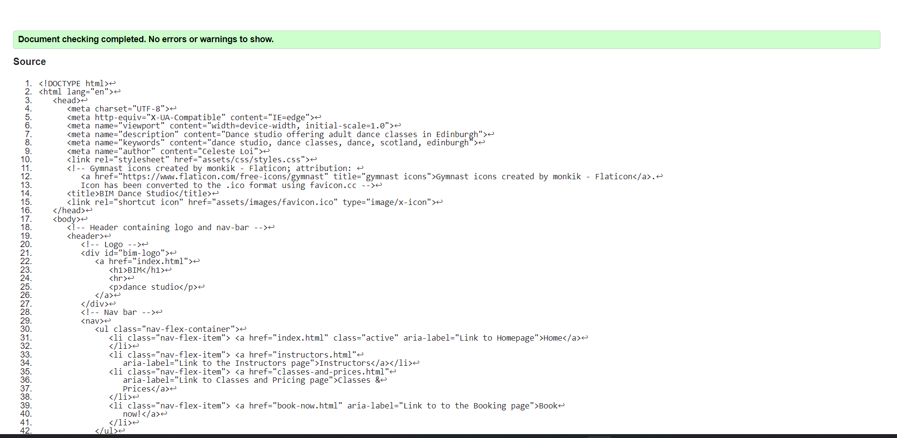

# BIM Dance Studio Testing

## TABLE OF CONTENTS

1) [Manual Testing](TESTING.md/#1-manual-testing)
    - [Internal links](TESTING.md/#internal-links)
    - [External links](TESTING.md/#external-links)
    - [Booking page](TESTING.md/#booking-page)
2) [Code Validation](TESTING.md/#2-code-validation)
    - [W3C HTML Validation](TESTING.md/#w3c-html-validation-results)
    - [W3C (Jigsaw) CSS Validation](TESTING.md/#w3c-jigsaw-css-validation-results)
3) [Responsiveness testing](TESTING.md/#3-responsiveness-testing)
    - [Homepage responsiveness](TESTING.md/#homepage-responsiveness)
    - [Intstrctors page responsiveness](TESTING.md/#instructors-page-responsiveness)
    - [Classes and prices responsiveness](TESTING.md/#classes--prices-responsiveness)
    - [Booking page responsiveness](TESTING.md/#booking-page-responsiveness)
    - [Booking confirmation page responsiveness](TESTING.md/#booking-confirmation-page-responsiveness)
4) [Browser compatibility](TESTING.md/#4-browser-compatibility)
5) [Bugs and fixes](TESTING.md/#5-bugs--fixes)
6) [Lighthouse reports](TESTING.md/#6-lighthouse)
7) [User testing](TESTING.md/#7-user-testing)

[⬅ Back to the README.md file](README.md)

## 1) MANUAL TESTING

- ### Internal links

- All of the buttons that link to internal parts of the website (other pages of the same one or section of the same page/other pages) have been tested and work with no issues.

- All of the navigation bar links work and link to the right pages

- The back to top button correctly does its job

- The logo correctly links to the homepage when clicked 

The link to the book-now.html in the booking confirmation page has been tested and works.

Also the link to the homepage in the booking confirmation page works with no issues.

All of the internal links in the hamburger menu for small screen sizes work and link correctly to the appropriate pages.

- ### External links

The only external links in the website are found in the footer, social media section. 
All of them have been coded and tested for opening in a new tab.

- ### Booking page

The reset button in the booking page resets the form correctly.

- The booking form inputs are rightly validated

- The submit button in the booking form has been tested to make sure it links to the booking confirmation page.

[Back to top ↑](TESTING.md/#bim-dance-studio-testing)

## 2) CODE VALIDATION

All HTML for BIM Dance Studio website passes through the [W3C HTML validator](https://validator.w3.org/) with no errors or warnings.

- ### W3C HTML VALIDATION RESULTS

1) #### Index.html

2) #### Instructors.html

3) #### classes-and-prices.html

4) #### book-now.html

5) #### booking-confirmation.html

- ### W3C (Jigsaw) CSS VALIDATION RESULTS

All the CSS written for BIM Dance Studio passes through the [Jigsaw CSS validator](https://jigsaw.w3.org/css-validator/) with no errors.

[Back to top ↑](TESTING.md/#bim-dance-studio-testing)

## 3) RESPONSIVENESS TESTING

All of the website pages have been tested for responsiveness using the Developer Tools in Google Chrome. 
Both the "device mode" and "responsive" function have been involved in the process, to make sure all of the website features and media queries are working as intended.

All of the features that are common to all of the pages show the responsiveness aimed:

- The navigation bar correctly floats under the logo from 1012px and disappears into the hamburger menu from 666px and down.

- The three footer blocks behave as programmed: from 768px and under, the Contacts and Opening times block are displayed on the same row, and the social media links on their own row at the bottom.
At 666px and down, the footer is still fully responsive displaying each block in its own row.

- ### Homepage responsiveness

- The "genres taught" section correctly switches to display the genres in a column at 768px and under, and the carousel shows up as its meant to at 666px and down.

- From 768px and under the "meet the team" section text is rightly displayed above the button

- The location map is fully responsive

- ### Instructors page responsiveness

- At 666px and down, the instructor specifics and details for each instructor block correctly float under the instructore profile picture

- The two buttons at the end of the page switch to display one under the other when reaching small screen sizes

- ### Classes & Prices responsiveness

- When reaching 768px, the classes timetable is fully responsive and switches to a single table for each day of the week

- At 666px and down the color legend blocks display correctly in a column

- ### Booking page responsiveness

- From 1012px, the inputs for name, surname, email address and telephone number display in a column as intended

- When the screen reaches 768px the input for date and select element for time correctly float one under the other

- When the screen is shrunk for medium devices (768px and down) the genre and payment options labels and respective radios and checkboxes correctly occupy a single row by their own.

- ### Booking confirmation page responsiveness

When tested for responsiveness, also the booking confirmation page hasn't shown any issue.

[Back to top ↑](TESTING.md/#bim-dance-studio-testing)

## 4) BROWSER COMPATIBILITY 

BIM Dance Studio website has been tested for browser compatibility in the following browser:

- Google Chrome

- Firefox

- Opera

- Microsoft Edge

[Back to top ↑](TESTING.md/#bim-dance-studio-testing)

## 5) BUGS & FIXES

- Error (1) in the validation process from all of the html pages

An error was returned while trying out the html validation during the website coding. Quickly fixed by deleting that extra/unnecessary space.

- Error (2) in the validation process from all of the html pages

The initial approach of enclosing the buttons inside of an anchor element to link to the appropriate pages/parts of the pages was detected as an error from the HTML validation service. It was fixed by changing approach and linking the buttons using the "onclick" Javascript function.

- index.html validator warning:

The second time the homepage was run through the validator, it returned a warning: this was easily fixed by switching the paragraph in the "meet the team" section with an h2 and giving this last one an ID to target it in the styles.css and contrast the bold font-weight style that was coming from the other h2's style.

- instructors.html validator warning:

The instructors page gave back a warning regarding the buttons section: easily and quickly fixed by replacing the section with a division block instead. 

- Back-to-top button bug

While testing the website I noticed that, even if the Javascript function was instructing the button to stop before the footer, as soon as the screen kept been scrolled down at the end of the footer and scrolled back up, the back-to-top button started going below the footer and "shaking" up and down as if the function for keeping it above the footer wasn't agreeing with the CSS for the button that is positioning it 80px from the bottom.
I've decided to fix it by removing the function and allow the button to go below the footer, since in small screen devices this last one is anyway a large section that would be improved by the button presence.

- Booking page: payment option checkboxes required

Testing the booking page, I realised that the form couldn't be submitted because of the first payment option being set as "required". Since the initial goal was to make the block of checkboxes related to payment a required field, and not a specific checkbox, I've deciced to remove the required attribute and ignore it for now, because it would have needed the use of jQuery to reach my initial aim. It would be implemented in the future when the booking page is a properly functioning one and works as explained in the [future features to implement](README.md/#features-to-implement-in-the-future) section of the README file.

- Through the end of the development process, while testing responsiveness, I noticed a whitespace/scroll to the right at 632px and down in the homepage. Also, a part of the navigation bar was disappearing to the top while scrolling down.
Using the _Inspector_ in the Developer Tools I identified that the issue was coming from the _min-width_ in the genres taught paragraphs set to 95vw. 
Setting the min-width to 88vw fixed both of the problems (commit __5522eaa__).

- After commit __799c842__ I noticed a breakpoint starting from 1012px: the hero content was overlapping with the nav bar. Its content was also overflowing and hiding due to the _overflow: hidden_ property I had applied to it.
Fixed by adding a media query to elongate from that breakpoint the hero outer section and setting a margin-top of 40%.

- After asking a project review on the channel _peer-code-review_ on Slack, _Harry Dhillon_ noticed that if the first time slot in the select options for a time in the Booking page was selected, the form couldn't be submitted.

To fix that, I've added a default option with the content _"Choose a time slot"_ with an empty value, and added values to the time slot options. Also made sure the new changes were validated by the W3C HTML validator, returning no errors or warnings.

[Back to top ↑](TESTING.md/#bim-dance-studio-testing) 

## 6) LIGHTHOUSE

All of the pages have been tested with [Lighthouse Chrome Developer tool](https://chrome.google.com/webstore/detail/lighthouse/blipmdconlkpinefehnmjammfjpmpbjk?hl=en): Performance, Accessibility and Best Practices all came back with scores __above 90__ from the reports.

- Homepage Lighthouse report:

- Instructors page Lighthouse report:

- Classes & Prices Lighthouse report:

- Booking page Lighthouse report:

- Booking confirmation page Lighthouse report:

[Back to top ↑](TESTING.md/#bim-dance-studio-testing)

## 7) USER TESTING

In addition to the above testing, I've asked my family, friends and peers on Slack to review my project and test it on their devices. The response was overall very positive and their feedback invaluable. No issues were encountered on their devices.

[Back to top ↑](TESTING.md/#bim-dance-studio-testing)